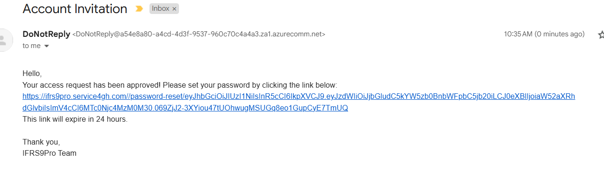
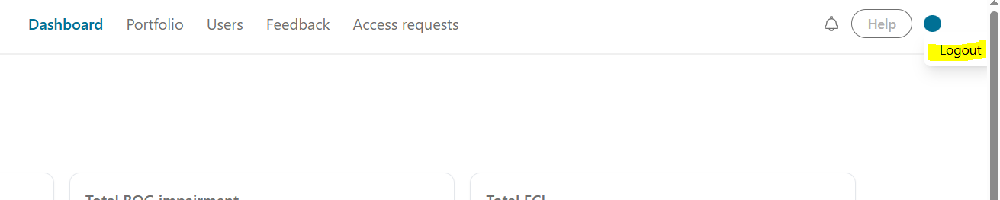

# Granting users access and controlling access

## Introduction
1. In order to request access visit https://ifrs9pro.service4gh.com/ and click 'request access'
2. Enter your email address and click request access
3. A verficatoin email is sent to your email address. Click the verification email to verify your email address.
4. After email verification, enter the email address of the inviting admin and click 'submit'. An access reqeuest is sent to the Admin. Once the admin grants your access request. you'll receive an email notification
5

## Requesting Access

1. In order to request access visit https://ifrs9pro.service4gh.com/ and click 'request access'
2. Enter your email address and click request access
3. A verficatoin email is sent to your email address. Click the verification email to verify your email address.
4. After email verification, enter the email address of the inviting admin and click 'submit'. An access reqeuest is sent to the Admin. Once the admin grants your access request. you'll receive an email notification

## Setting password
1. Follow the link as in the image above
2. Enter your password and repeat.
3. If password setting is successful, you'll see a password set successfully message

## Signing in
1. To sign in visit https://ifrs9pro.service4gh.com/ and enter your sign in information

## Signing out

1. To sign out click logout as in the image above

    mkdocs.yml    # The configuration file.
    docs/
        index.md  # The documentation homepage.
        ...       # Other markdown pages, images and other files.
