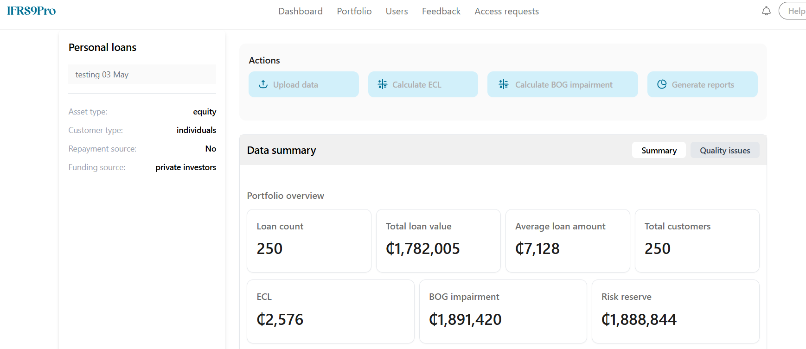
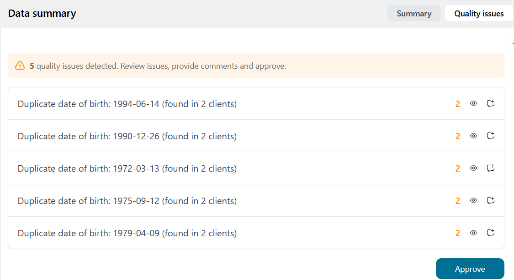

# Welcome to IFRS9 Pro Portfolios

Read information below for guidance on maintaining and running a portfolio!.

## Creating a portfolio

1. Select Portfolio from navigation bar
2. Select New Portfolio
3. Complete the Porfolio creation form to successfully create porfolio
4. Identify your portfolio from the list of porfolios.
5. Click the Ellipsis on the far right and select view portfolio to view portfolio

## Ingesting data

1. Click Ingest data and follow steps to ingest data. Data to be ingested are Loan details, customer details, collateral details, and guarantee data.

## Reviewing Ingested data

1. After ingestion click "Quality issues" to view and review quality issues in data ingested.

## Calculating IFRS 9's ECL

1. To calculate IFRS 9's ECL, simply click Calculate ECL. This can take a long while to complete depending on the size of loan data.

## Calculating Local Impairment

1. To calculate BOG impairment, simply click Calculate BOG Impairment. This can take a long while to complete depending on the size of loan data.

## Generating reports
The application supports the generation of 5 types of reports:

* `Detail IFRS 9 ECL report` - The Detailed ECL (Expected Credit Loss) Report provides a granular view of impairment metrics for each loan in your portfolio. Designed specifically for finance teams, auditors, and risk professionals, this report presents all key inputs and outputs used in your ECL calculation under IFRS 9.

* `Summary IFRS 9 ECL Report` - This report provides a high-level overview of loan exposures and impairment by IFRS 9 stage classification. It is ideal for board reporting, provisioning reviews, and risk monitoring.

* `Detail BOG Impairment report` - The Detailed BOG Impairment report provides a granular view of impairment metrics for each loan in your portfolio. Designed specifically for finance teams, auditors, and risk professionals, this report presents all key inputs and outputs used in your BOG Impairment calculation under BOG regulations.

* `Summary BOG Impairment Report` - This report provides a high-level overview of loan exposures and impairment by BOG stage classification. It is ideal for board reporting, provisioning reviews, and risk monitoring.

* `Journals Report` - The **Journals Report** provides the journal entries required to recognised the impact of IFRS9 ECL and BOG Impairment on the related financial assets. 

### Report Highlights

- **GL Account Code**: References from your configured Chart of Accounts.
- **Journal Description**: Clearly describes the purpose of the entry—whether for IFRS 9 recognition or BoG top-up.
- **Journal Amount (GHS)**: Shows the financial impact with debits and credits automatically balanced.

---

## 📘 Sample Journals Report

| GL Account Code | Journal Description                              | Journal Amount (GHS) |
|-----------------|---------------------------------------------------|----------------------|
| `8E723H7E282`   | IFRS9 Impairment - P&L charge                     | 2,575.51             |
| `89U298`        | IFRS9 Impairment - impact on loans                | -2,575.51            |
| `8E723H7E282`   | Top up for BOG Impairment - P&L charge            | 1,902,181.34         |
| `3JRJ2`         | Credit risk reserve                               | -1,902,181.34        |

---

## Benefits

- Maps directly to your general ledger accounts.
- Output can be exported to Excel.

> **Note:** reports are generated based on your institution’s specific impairment settings and portfolio balances.

To generate any of the above reports click "generate reports" and select yoru preferred report. Select a date and generate the report. The report is automatically saved and made availabe for download.

